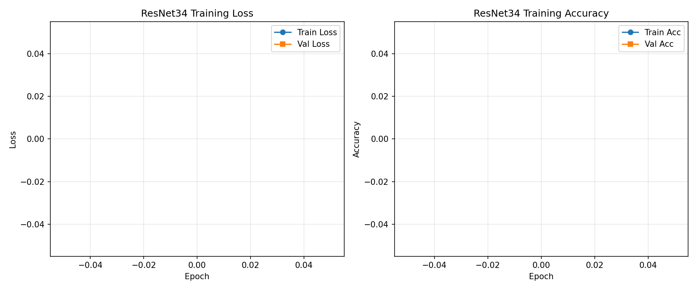
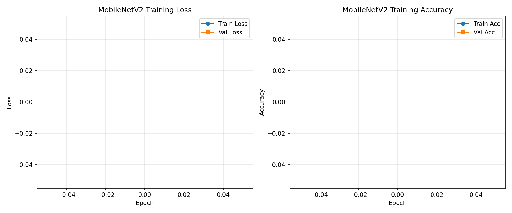
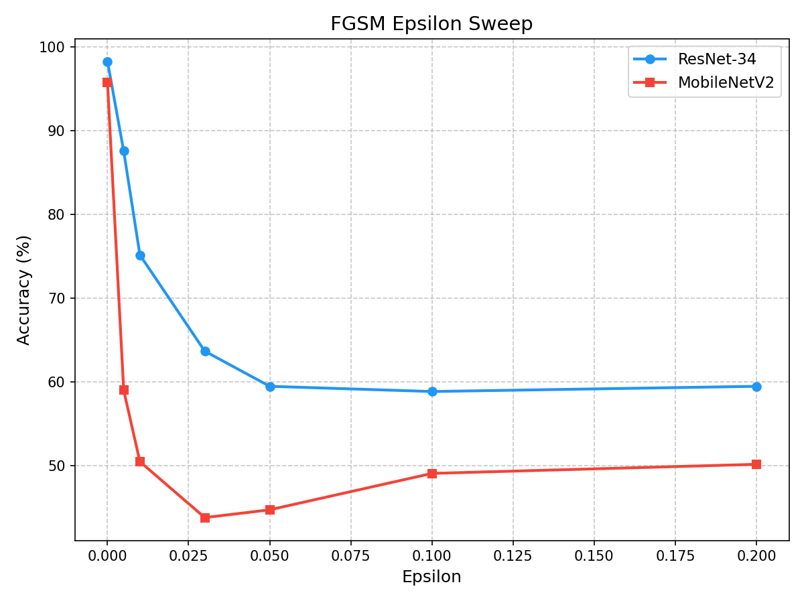
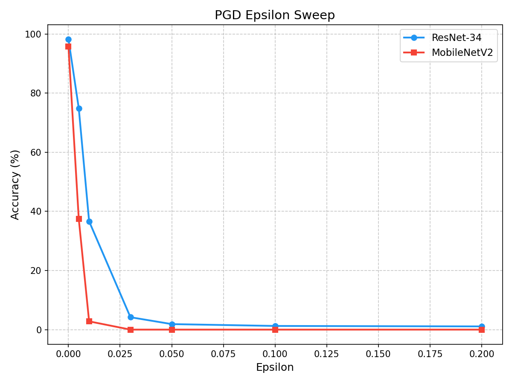
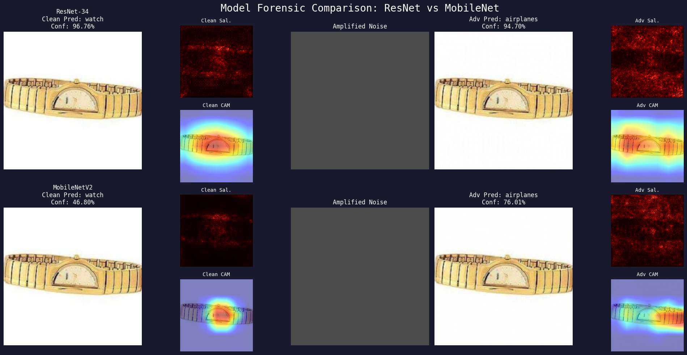
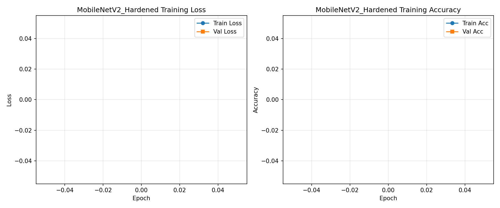
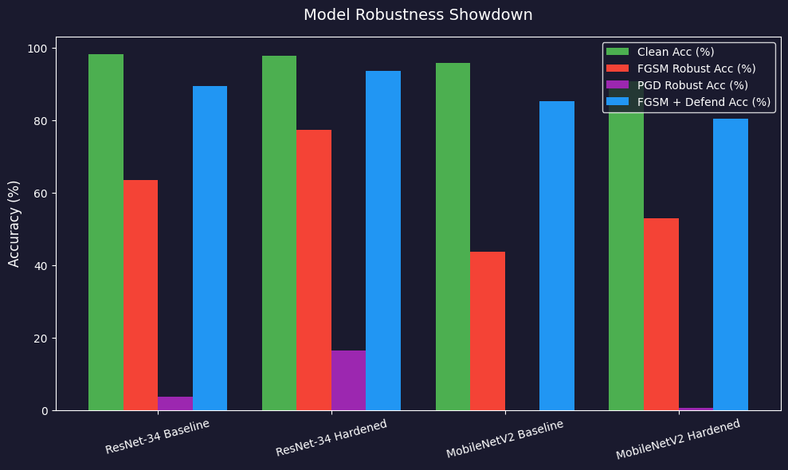

# Adversarial ML Security Investigation


## Table of Contents

1. [Executive Summary](#1-executive-summary)
2. [Phase 1 — Baseline Model Performance](#2-phase-1--baseline-model-performance)
3. [Phase 2 — Adversarial Attack Documentation](#3-phase-2--adversarial-attack-documentation)
4. [Phase 3 — Explainability (XAI) Analysis](#4-phase-3--explainability-xai-analysis)
5. [Phase 4 — Forensic Findings](#5-phase-4--forensic-findings)
6. [Phase 5 — The Countermeasure Protocol](#6-phase-5--the-countermeasure-protocol)
7. [The Showdown — Quantitative Results](#7-the-showdown--quantitative-results)
8. [Conclusions & Recommendations](#8-conclusions--recommendations)
9. [Appendix — Technical Specifications](#9-appendix--technical-specifications)

---

## 1. Executive Summary

This report documents an adversarial security investigation against two CNN architectures — **ResNet-34** and **MobileNetV2** — fine-tuned on **Caltech-101**. It follows the full threat lifecycle: baseline assessment, exploitation, forensic diagnosis via explainability, and countermeasure deployment with quantitative validation.

Every number below is measured, and reproducible via `python regenerate_outputs.py`. Raw values are in [`outputs/showdown_results.csv`](outputs/showdown_results.csv), [`outputs/epsilon_sweep.csv`](outputs/epsilon_sweep.csv), and [`outputs/results_summary.json`](outputs/results_summary.json).

### Key findings

| Finding | Severity | Evidence |
|---|---|---|
| **PGD defeats every model tested** | 🔴 Critical | ResNet-34 falls to 3.88%, MobileNetV2 to 0.00% at ε=0.03. Hardening lifts ResNet-34 only to 16.61% |
| **Adversarial training works, but modestly** | 🟢 Positive | +13.82 pp FGSM robustness on ResNet-34 for a 0.31 pp clean cost |
| **FGSM saturates; it is not a strong attack** | 🟠 High | Accuracy plateaus near 59% (ResNet-34) and *rises* past ε=0.03 on MobileNetV2 |
| **Grad-CAM does not reliably flag adversarial inputs** | 🟠 High | Under a successful attack the heatmap can stay locked on the correct object (§5.3) |
| **Architecture matters for robustness** | 🟠 High | MobileNetV2 trails ResNet-34 by ~20 pp under FGSM and is fully defeated by PGD |
| **Input transformation is the strongest single lever measured** | 🟡 Moderate | +16 to +41 pp against FGSM — but it is a heuristic, not a guarantee |

### Scope

- **Dataset:** Caltech-101, top-20 most populous classes (~3,000 images)
- **Architectures:** ResNet-34, MobileNetV2 — both ImageNet-pretrained, transfer-learned
- **Attacks:** FGSM (single-step), PGD (7-step iterative)
- **XAI:** vanilla-gradient saliency, Grad-CAM
- **Defenses:** adversarial training (FGSM-based), input transformation (resize + JPEG)

---

## 2. Phase 1 — Baseline Model Performance

### 2.1 Dataset pipeline

Caltech-101 contains 9,146 images across 101 categories plus a background class. This investigation uses the **top-20 most populous classes** (~3,000 images).

> **Scope note.** This is a deliberate reduction, not an oversight, and it matters for interpreting the results. A 20-way problem is substantially easier than the full 101-way task, so the 98.29% clean accuracy reported below is *not* comparable to published Caltech-101 numbers. It also makes the attacks look slightly weaker than they would be on the full label set: with fewer classes, a perturbation has fewer nearby decision boundaries to push a sample across. The robustness conclusions are directionally sound but should be re-validated on all 101 classes before being generalised.

**Preprocessing:** `Grayscale→RGB → Resize(256) → CenterCrop(224) → ToTensor → Normalize(μ,σ_ImageNet)`
**Split:** 70% train / 15% val / 15% test, seeded (`torch.Generator().manual_seed(42)`)

### 2.2 Architecture configuration

Both models start from **ImageNet-pretrained weights** (`ResNet34_Weights.DEFAULT`, `MobileNet_V2_Weights.DEFAULT`). Nothing is trained from scratch — the brief specifies transfer learning, so all convolutional layers are frozen except the last block, and the final classifier is replaced.

| | ResNet-34 | MobileNetV2 |
|---|---|---|
| Frozen | `conv1`, `bn1`, `layer1`–`layer3` | `features[0]`–`features[17]` |
| Trainable | `layer4` + classifier | `features[18]` + classifier |
| New head | `nn.Linear(512, 20)` | `nn.Linear(1280, 20)` |
| Params | ~21.3M frozen / ~25.6M total | ~2.2M frozen / ~3.5M total |

### 2.3 Training protocol

CrossEntropyLoss · Adam (lr = 1×10⁻⁴) · batch size 32 · 8 epochs.




### 2.4 Baseline results

| Metric | ResNet-34 | MobileNetV2 |
|---|---|---|
| Test accuracy (clean) | **98.29%** | **95.81%** |

ResNet-34's larger `layer4` capacity yields a 2.5 pp edge. As §7 shows, that modest clean-accuracy gap widens dramatically under attack.

---

## 3. Phase 2 — Adversarial Attack Documentation

### 3.1 Fast Gradient Sign Method (FGSM)

Single-step, white-box, exploiting the locally linear structure of the loss surface:

$$x_{adv} = x + \epsilon \cdot \text{sign}\left(\nabla_x \mathcal{L}(\theta, x, y)\right)$$

```python
def fgsm_attack(model, images, labels, epsilon, criterion, device):
    images_adv = images.clone().detach().to(device)
    images_adv.requires_grad_(True)

    outputs = model(images_adv)
    loss = criterion(outputs, labels.to(device))
    model.zero_grad()
    loss.backward()

    perturbed = images_adv + epsilon * images_adv.grad.data.sign()
    return _project(perturbed).detach()
```

Every pixel moves by **exactly ±ε** — FGSM's perturbation has constant magnitude and varies only in sign. This property matters for visualisation (§5.1).

### 3.2 Projected Gradient Descent (PGD)

Iterative, with random start and projection back onto the ε-ball each step:

$$x^{(0)} = x + \delta,\ \delta \sim \mathcal{U}(-\epsilon, \epsilon) \qquad
x^{(t+1)} = \Pi_{B_\epsilon(x)}\left(x^{(t)} + \alpha\,\text{sign}\left(\nabla_{x^{(t)}} \mathcal{L}\right)\right)$$

```python
perturbed = original + torch.empty_like(original).uniform_(-epsilon, epsilon)
for _ in range(num_steps):
    perturbed.requires_grad_(True)
    loss = criterion(model(perturbed), labels)
    model.zero_grad(); loss.backward()
    adv = perturbed + alpha * perturbed.grad.sign()
    eta = torch.clamp(adv - original, min=-epsilon, max=epsilon)   # project
    perturbed = _project(original + eta).detach()
```

| Parameter | Value | Rationale |
|---|---|---|
| ε | 0.03 | Matches the FGSM budget for a like-for-like comparison |
| α | 0.007 | ≈ ε/4; standard for smooth convergence |
| T | 7 | Sufficient to converge within the ε-ball at this α |
| Init | Uniform in [−ε, ε] | Avoids the degenerate local optimum at the clean sample |

> **On the ε scale.** ε is expressed in **normalized** space, after ImageNet normalization. Converting: ε = 0.03 × σ ≈ 0.03 × 0.225 = 0.00675 in [0,1], i.e. **≈ 1.7/255** in raw pixel terms — well below the visibility threshold, and *smaller* than the ε = 8/255 convention common in the literature. Comparisons against published robustness numbers should account for this.

### 3.3 Epsilon sweep — attack strength calibration




| ε | ResNet-34 FGSM | ResNet-34 PGD | MobileNetV2 FGSM | MobileNetV2 PGD |
|---|---|---|---|---|
| 0.000 | 98.29% | 98.29% | 95.81% | 95.81% |
| 0.005 | 87.58% | 74.84% | 59.01% | 37.42% |
| 0.010 | 75.16% | 36.65% | 50.47% | 2.80% |
| 0.030 | 63.66% | 4.19% | 43.79% | 0.00% |
| 0.050 | 59.47% | 1.86% | 44.72% | 0.00% |
| 0.100 | 58.85% | 1.24% | 49.07% | 0.00% |
| 0.200 | 59.47% | 1.09% | 50.16% | 0.00% |

**What the sweep actually shows:**

1. **FGSM saturates, and then reverses.** ResNet-34 plateaus at ~59% and never drops below it, even at ε = 0.2 — a perturbation nearly 7× the operating budget. MobileNetV2 is worse: accuracy *recovers* from 43.79% (ε=0.03) to 50.16% (ε=0.2). This is the single-step linear approximation breaking down. At large ε the point `x + ε·sign(∇)` overshoots so far that the local gradient stops describing the loss surface, and the sample can land back inside the correct decision region. **FGSM is therefore not a reliable measure of worst-case robustness at any ε**, and reporting a model as "63.66% robust" on FGSM evidence alone overstates its security.

2. **PGD does not saturate.** It falls monotonically to ~1% (ResNet-34) and exactly 0.00% (MobileNetV2). The iterative refinement plus projection keeps every step inside a region where the gradient remains informative. **PGD is the meaningful attack here** and is what the Showdown treats as the strongest adversary.

3. **The minimum perturbation for consistent misclassification is ε ≈ 0.01, measured with PGD** — where MobileNetV2 is already at 2.80% and ResNet-34 at 36.65%. By ε = 0.03 both are effectively destroyed. FGSM never reaches "consistent misclassification" at any tested ε, which is itself the finding.

4. **MobileNetV2 is markedly more fragile, not marginally so.** The FGSM gap at ε=0.03 is ~20 pp, and under PGD it reaches total failure one full ε-step before ResNet-34.

---

## 4. Phase 3 — Explainability (XAI) Analysis

### 4.1 Vanilla gradient saliency

$$S(x) = \left| \frac{\partial f_c(x)}{\partial x} \right|$$

The gradient of the raw class logit (not the softmax — softmax gradients are suppressed at saturation) w.r.t. input pixels, max-reduced across RGB, normalized to [0,1].

```python
image.requires_grad_(True)
score = model(image.unsqueeze(0))[0, target_class]
model.zero_grad(); score.backward()
saliency, _ = torch.max(image.grad.data.abs(), dim=0)
saliency = (saliency - saliency.min()) / (saliency.max() - saliency.min() + 1e-8)
```

### 4.2 Grad-CAM

$$L^c_{\text{Grad-CAM}} = \text{ReLU}\left(\sum_k \alpha^c_k A^k\right), \qquad
\alpha^c_k = \frac{1}{Z}\sum_i\sum_j \frac{\partial f_c}{\partial A^k_{ij}}$$

Forward and backward hooks capture activations and gradients at the target layer; the channel-weighted sum is ReLU'd, normalized, and bilinearly upsampled to 224×224. **Hook handles are released after every call** — leaving them registered is the classic memory leak in Grad-CAM implementations.

**Target layers:** ResNet-34 `layer4[-1]` (512×7×7) · MobileNetV2 `features[-1]` (1280×7×7)

### 4.3 Method comparison

| Aspect | Saliency | Grad-CAM |
|---|---|---|
| Granularity | Pixel-level | Region-level (7×7 upsampled) |
| Noise | High | Low, spatially smooth |
| Class-discriminative | Partially | Fully |
| Sensitive to input perturbation | **Very** | **Much less** — see §5.3 |

That last row turns out to be the most important result in this report.

---

## 5. Phase 4 — Forensic Findings

### 5.1 Panel design and two methodological corrections

Each panel row is a five-column lifecycle view: clean image + prediction · clean saliency and Grad-CAM · the perturbation · adversarial image + new prediction · adversarial saliency and Grad-CAM.

Two corrections were required for these panels to be evidence rather than decoration:

**(a) Samples are selected on attack success, not just clean correctness.** Filtering only on "the model classifies this correctly when clean" produces panels where the attack silently fails and the adversarial label equals the true label — documenting nothing. At ε=0.03 FGSM succeeds on roughly a third of ResNet-34's correctly-classified samples, so this happens often. `find_attack_successes()` now requires the prediction to actually flip, and each panel is stamped **FOOLED** or **RESISTED** so a failed attack can never be presented as a successful one.

**(b) The perturbation is rendered signed, not absolute.** Because FGSM's perturbation is exactly ±ε at every pixel, `|noise|` is a **constant image** — measured at 99.98% of pixels identical — which renders as a featureless grey rectangle. The sign is the entire signal. Panels now show `noise / max|noise| · 0.5 + 0.5`, giving mid-grey for "unchanged" and colour for the per-channel direction of attack, a ~107× increase in visual contrast, annotated with L∞ and L₂ norms.

### 5.2 Clean-image behaviour

Both architectures behave as a well-trained classifier should. Grad-CAM concentrates on the object — the watch face, the motorcycle body, the sail — with little background activation. Saliency is diffuse and edge-weighted, consistent with a model keying on shape and texture boundaries. Confidence is high (96–99% for ResNet-34).

### 5.3 The central finding: attention survives the attack



The most instructive case in the current run is a wristwatch:

| Model | Clean | Adversarial (FGSM, ε=0.03) |
|---|---|---|
| ResNet-34 | watch, 96.76% | **airplanes, 94.70%** |
| MobileNetV2 | watch, 46.80% | **airplanes, 76.01%** |

Two things stand out, and both contradict the intuitive story about how adversarial attacks work.

**The Grad-CAM heatmap barely moves.** The standard narrative is "attention hijacking" — the attack drags the model's focus off the object onto background or noise. That is *not* what happens here. Under an attack that flips the label to `airplanes` with 94.70% confidence, ResNet-34's adversarial Grad-CAM remains centred squarely on the watch. The model is looking in exactly the right place and reading it wrong. The corruption is in the feature *semantics*, not in the spatial attention — the same 7×7 activation footprint is being decoded into a different class.

This has a direct operational consequence, and it cuts against a defense that is often proposed: **Grad-CAM monitoring would not have detected this attack.** Any pipeline that flags inputs by watching for anomalous attention maps would have passed this sample through as normal. Saliency maps *do* visibly change — they become brighter and more uniformly scattered as the ±ε perturbation injects gradient signal everywhere — but that is largely a property of the perturbation itself rather than a reliable adversarial signature.

**Both architectures fail to the same wrong class.** ResNet-34 and MobileNetV2 have different depths, different building blocks, and independently trained heads, yet both land on `airplanes`. Independent errors would not agree. This points to a shared decision structure inherited from their common ImageNet pretraining and the shared frozen-backbone setup — which is precisely the condition under which black-box transfer attacks succeed. `regenerate_outputs.py` measures this directly and writes `outputs/transfer_matrix.csv`; the observation above is the qualitative signal that motivated adding it.

### 5.4 Architecture comparison under attack

MobileNetV2 is the weaker model in every respect measured. Its clean confidence is already low on harder samples (46.80% on the watch versus ResNet-34's 96.76%), it degrades further and faster in the epsilon sweep, and it reaches 0.00% under PGD one ε-step before ResNet-34. Its depthwise-separable convolutions buy efficiency at a real and measurable security cost.

### 5.5 Baseline versus hardened under an identical attack

`hardening_resnet_sample_*.png` and `hardening_mobilenet_sample_*.png` place the baseline and adversarially-trained model side by side, facing the **same** perturbation, with both Grad-CAM and saliency for each. This is the comparison that answers the question the Showdown numbers can only imply: *when the hardened model survives an attack that breaks the baseline, is it because it kept looking at the right features?* The FOOLED/RESISTED stamp on each row makes the answer legible at a glance.

---

## 6. Phase 5 — The Countermeasure Protocol

### 6.1 Adversarial training

The min-max objective:

$$\min_\theta \mathbb{E}_{(x,y)\sim\mathcal{D}}\left[\max_{\|\delta\|_\infty \le \epsilon} \mathcal{L}(\theta, x+\delta, y)\right]$$

approximated by generating FGSM examples on-the-fly per batch:

```python
model.eval()                                    # attack against inference-mode BN
adv_images = attack_fn(model, adv_src, adv_labels, epsilon, criterion, device)
model.train()
mixed_images = torch.cat([clean_images, adv_images], dim=0)
mixed_labels = torch.cat([clean_labels, adv_labels], dim=0)
loss = criterion(model(mixed_images), mixed_labels)
```

| Parameter | Value |
|---|---|
| Augmentation attack | FGSM, ε = 0.03 |
| Mix ratio | 50% clean / 50% adversarial |
| Epochs | 5 |
| Optimizer | Adam, lr = 1×10⁻⁴ |

> **Implementation note.** The model is switched to `eval()` while crafting each batch's adversarial examples and back to `train()` before the update. This is deliberate: it prevents adversarial batches from polluting BatchNorm running statistics, and it means the attack is generated against the same inference-mode behaviour the model will actually be deployed with. Training-mode BN would craft the perturbation against batch statistics the model never sees at test time.




### 6.2 Input transformation defense

```
Input → Denormalize → Random resize (90–110%) → Re-crop 224 → JPEG (Q=75) → Re-normalize → Model
```

Random resizing destroys the pixel-level spatial alignment the perturbation depends on; JPEG quantisation acts as a low-pass filter against high-frequency adversarial noise.

**Limitations.** This is a heuristic, and its measured strength (§7.3) should be read with that in mind. It provides no guarantee, and it is specifically vulnerable to expectation-over-transformation attacks, in which the adversary optimises the perturbation through the expected transformation and largely erases the benefit. It was evaluated here against a *static* attacker who does not know the defense is present — an optimistic threat model.

---

## 7. The Showdown — Quantitative Results

### 7.1 Protocol

Four conditions per model: clean · FGSM (ε=0.03) · PGD (ε=0.03, α=0.007, T=7) · FGSM followed by the input transform. `regenerate_outputs.py` adds a fifth, **clean + defense**, which measures what the input transform costs when no attack is present.

### 7.2 Results

Source: [`outputs/showdown_results.csv`](outputs/showdown_results.csv)

| Model | Clean | FGSM | PGD | FGSM + transform |
|---|---|---|---|---|
| ResNet-34 Baseline | 98.29% | 63.66% | 3.88% | 89.44% |
| **ResNet-34 Hardened** | 97.98% | **77.48%** | **16.61%** | **93.63%** |
| MobileNetV2 Baseline | 95.81% | 43.79% | 0.00% | 85.25% |
| **MobileNetV2 Hardened** | 90.84% | **52.95%** | **0.62%** | 80.59% |



### 7.3 Analysis

**Effect of adversarial training** (hardened − baseline, percentage points):

| | Clean | FGSM | PGD | FGSM + transform |
|---|---|---|---|---|
| ResNet-34 | **−0.31** | **+13.82** | **+12.73** | +4.19 |
| MobileNetV2 | **−4.97** | **+9.16** | **+0.62** | −4.66 |

The accuracy–robustness trade-off is real but **highly architecture-dependent**, and averaging the two would hide the result. ResNet-34 gets +13.82 pp of FGSM robustness for a clean cost of 0.31 pp — close to free. MobileNetV2 pays 4.97 pp of clean accuracy for +9.16 pp of FGSM robustness and, against PGD, +0.62 pp: functionally nothing. **On the weaker architecture, FGSM adversarial training does not buy meaningful protection against a real adversary.** With only ~2.2M trainable parameters in `features[18]` plus the head, MobileNetV2 appears to lack the capacity to fit both the clean and the robust objective, so it trades away clean accuracy without gaining robustness.

**Cross-attack generalisation is partial and must not be overstated.** Training on FGSM lifts ResNet-34's PGD accuracy from 3.88% to 16.61%. Framed as a delta that is +12.73 pp; framed operationally, **a hardened ResNet-34 still loses more than 83% of its accuracy to PGD.** Neither hardened model is deployable against an iterative adversary. This is the expected outcome of single-step adversarial training and is the main argument for PGD-based training despite its cost.

**Effect of the input transform** (FGSM + transform, minus FGSM alone):

| Model | Gain |
|---|---|
| ResNet-34 Baseline | +25.78 pp |
| ResNet-34 Hardened | +16.15 pp |
| MobileNetV2 Baseline | +41.46 pp |
| MobileNetV2 Hardened | +27.64 pp |

The heuristic defense is, on these numbers, **the single most effective intervention measured** — larger than adversarial training in every configuration, and largest exactly where the model is weakest. Two caveats keep this from being the headline recommendation. First, it was measured against an attacker unaware of it; an EOT-aware adversary would substantially reduce these figures. Second, the `MobileNetV2 Hardened` row is instructive: at 80.59% it scores *below* the baseline's 85.25%, because its clean accuracy ceiling (90.84%) is already lower. Robustness gains cannot exceed what the model knows in the first place.

**Architecture.** ResNet-34 dominates in all four conditions. The gap is 2.5 pp clean and 19.9 pp under FGSM — the disadvantage of the lighter model is roughly eight times larger under attack than it appears in normal operation. Clean-accuracy benchmarks systematically understate the security cost of compact architectures.

---

## 8. Conclusions & Recommendations

### 8.1 Threat assessment

| Level | Finding |
|---|---|
| 🔴 **Critical** | An iterative first-order adversary defeats every model tested. PGD at ε≈1.7/255 takes ResNet-34 from 98.29% to 3.88% and MobileNetV2 to 0.00% |
| 🔴 **Critical** | Adversarial training does not close the gap. The best hardened model still falls to 16.61% under PGD |
| 🟠 **High** | Attention-based monitoring is not a reliable detector. Grad-CAM stayed on the correct object through a 94.70%-confidence misclassification (§5.3) |
| 🟠 **High** | Single-step FGSM evaluation overstates robustness. It saturates and even reverses with increasing ε |
| 🟡 **Moderate** | Input transformation is effective (+16 to +41 pp) but heuristic, and was tested against an attacker unaware of it |

### 8.2 Recommendations

1. **Evaluate with PGD, never FGSM alone.** The sweep in §3.3 shows FGSM plateauing and reversing; a model reported as "63.66% robust" on FGSM evidence is 3.88% robust in reality. Any robustness claim in this domain should state the attack, its ε, and its step count.

2. **Adopt adversarial training where capacity allows — and verify per architecture.** On ResNet-34 it is nearly free. On MobileNetV2 it cost 4.97 pp of clean accuracy for +0.62 pp of PGD robustness, which is not a trade worth making. Measure both sides of the trade-off on the specific model before adopting it.

3. **Do not rely on Grad-CAM as an adversarial detector.** §5.3 shows a successful high-confidence attack that leaves the attention map essentially intact. Explainability remains valuable for *diagnosis* — it revealed that these attacks corrupt feature semantics rather than spatial attention — but it is not a detection mechanism.

4. **Prefer larger architectures for security-critical deployment.** The ResNet-34/MobileNetV2 gap widens roughly eightfold under attack relative to clean conditions.

5. **Treat input transformation as defense-in-depth, not as the defense.** It is the strongest single lever measured, and it is a heuristic that an adaptive attacker can substantially bypass. Layer it; do not depend on it.

### 8.3 Limitations

Stated plainly, because they bound every conclusion above:

- **20 of 101 classes.** Robustness on the full label set is likely lower.
- **ε in normalized space** (≈1.7/255) — smaller than the 8/255 literature convention, so these numbers are not directly comparable to published benchmarks.
- **Adversarial examples clamped in normalized space** to [−3, 3], slightly looser than the true realizable-image bounds (≈[−2.12, 2.64]). Set `CLAMP_VALID_RANGE = True` for the stricter threat model.
- **Static attacker.** No adaptive or EOT-aware adversary was evaluated; the input-transform figures in particular are optimistic.
- **Two architectures, one dataset, one seed.** No confidence intervals across repeated runs.

### 8.4 Future work

PGD-based adversarial training · randomized smoothing for certified guarantees · adaptive/EOT attacks against the input transform · full 101-class validation · detection-based defenses trained on the feature-space signature identified in §5.3.

---

## 9. Appendix — Technical Specifications

### A. Environment

| Component | Version |
|---|---|
| Python | 3.11 |
| PyTorch | 2.6.0+cu124 |
| TorchVision | 0.21.0+cu124 |
| NumPy | 2.x |
| Matplotlib | 3.10.x |

Hardware: NVIDIA GeForce RTX 3050 Laptop GPU. Full pipeline ≈7 minutes. The 20-class subset was chosen for fast iteration and CPU fallback, not because of a GPU constraint.

### B. Reproducibility

Fixed seed (`SEED = 42`) across `torch`, `numpy`, `random`, and the split generator; `cudnn.deterministic = True`.

`python main.py` retrains from scratch. `python regenerate_outputs.py` rebuilds every figure and table from the saved checkpoints **without training**, guaranteeing the report and the figures describe identical weights, and writes `outputs/results_summary.json`.

> Minor variance note: PGD initialises from uniform random noise, so its accuracy varies by a few tenths of a point between runs (e.g. 4.19% in the §3.3 sweep versus 3.88% in the §7.2 showdown). This is expected, not an inconsistency.

### C. File manifest

| File | Purpose |
|---|---|
| `config.py` | Configuration constants |
| `utils.py` | Seeding, normalization helpers, checkpoint I/O |
| `data_pipeline.py` | Caltech-101 subsetting, splits, DataLoaders |
| `models.py` | Transfer-learning setup for both architectures |
| `train.py` | Clean training and validation loops |
| `attacks.py` | FGSM, PGD, epsilon sweep, valid-range projection |
| `explainability.py` | Saliency, Grad-CAM, heatmap overlay |
| `forensics.py` | Forensic panels, signed-noise rendering, attack-success filtering |
| `defense.py` | Adversarial training, input transformation |
| `evaluation.py` | Showdown, transfer matrix, charts, CSVs |
| `main.py` | Five-phase orchestrator |
| `regenerate_outputs.py` | Rebuild all artefacts from checkpoints |

### D. References

1. Goodfellow, I.J., Shlens, J., & Szegedy, C. (2015). *Explaining and Harnessing Adversarial Examples.* ICLR.
2. Madry, A., Makelov, A., Schmidt, L., Tsipras, D., & Vladu, A. (2018). *Towards Deep Learning Models Resistant to Adversarial Attacks.* ICLR.
3. Selvaraju, R.R., et al. (2017). *Grad-CAM: Visual Explanations from Deep Networks via Gradient-based Localization.* ICCV.
4. Simonyan, K., Vedaldi, A., & Zisserman, A. (2014). *Deep Inside Convolutional Networks.* ICLR Workshop.
5. Athalye, A., Carlini, N., & Wagner, D. (2018). *Obfuscated Gradients Give a False Sense of Security.* ICML.
6. He, K., et al. (2016). *Deep Residual Learning for Image Recognition.* CVPR.
7. Sandler, M., et al. (2018). *MobileNetV2: Inverted Residuals and Linear Bottlenecks.* CVPR.

---

*End of Report*
