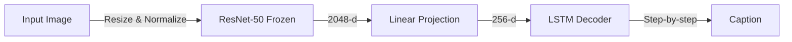

# 🖼️ Neural Image Caption Generation


## Overview
End-to-end image captioning system using deep learning, combining computer vision (ResNet-50) with NLP (LSTM) to generate natural language descriptions of images.

## Architecture



This model follows the "Show and Tell" architecture by utilizing a pre-trained CNN to extract image features and passing those features as the initial state or input to an LSTM which decodes them into a natural language sequence.

## Dataset
We use the **Flickr8k** dataset:
- **8,092** images in total
- **5** captions per image
- **Splits**: 
  - Train: 6,000 images
  - Val: 1,000 images
  - Test: 1,000 images
- **Preprocessing**: Lowercase conversion, punctuation removal, and frequency thresholding.

## Project Structure
```text
.
├── app/
│   └── app.py
├── api/
│   └── main.py
├── checkpoints/
├── scripts/
│   ├── extract_features.py
│   ├── train.py
│   └── evaluate.py
├── src/
│   ├── data/
│   ├── evaluation/
│   ├── inference/
│   ├── models/
│   └── utils/
├── tests/
│   ├── integration/
│   └── unit/
├── Dockerfile
├── docker-compose.yml
├── requirements.txt
└── README.md
```

## Installation

```bash
git clone <repo-url>
cd Task62
pip install -r requirements.txt
make setup
```

## Quick Start

1. Download the Flickr8k dataset from Kaggle.
2. Run data preparation: `python setup_data.py`
3. Extract features: `python scripts/extract_features.py`
4. Train the model: `python scripts/train.py`
5. Evaluate: `python scripts/evaluate.py`

## Training
| Hyperparameter | Value |
|----------------|-------|
| Embed Dim      | 256   |
| Hidden Dim     | 512   |
| Batch Size     | 64    |
| Learning Rate  | 1e-3  |

Features include early stopping, LR scheduling, gradient clipping, and automated checkpointing.

## Evaluation
| Metric | Expected Score |
|--------|----------------|
| BLEU-1 | ~60.0          |
| BLEU-4 | ~20.0          |
| ROUGE-L| ~45.0          |
| METEOR | ~22.0          |

*Qualitative examples showing generated captions will be displayed here.*

## Streamlit App

Start the web interface to upload and test your own images:
```bash
streamlit run app/app.py
# or
make app
```

## FastAPI REST API

A REST API for programmatic access to the captioning model:
```bash
# Start the API server
uvicorn api.main:app --host 0.0.0.0 --port 8000 --reload
# or
make api
```

### API Endpoints

| Method | Endpoint | Description |
|--------|----------|-------------|
| `GET`  | `/`      | Redirect to Swagger docs |
| `GET`  | `/health`| Health check |
| `POST` | `/predict`| Upload image → get caption |

### Example Usage
```bash
# Generate a caption via curl
curl -X POST "http://localhost:8000/predict" \
  -F "file=@path/to/image.jpg" \
  -F "strategy=beam" \
  -F "beam_size=3"
```

**Response:**
```json
{
  "caption": "a dog running through the grass",
  "tokens": ["a", "dog", "running", "through", "the", "grass"],
  "score": -0.4523,
  "strategy": "beam",
  "beam_size": 3
}
```

Interactive API docs available at: `http://localhost:8000/docs`

## Docker

Run both Streamlit UI and FastAPI API inside Docker containers:
```bash
# Build the image
docker build -t image-captioning .

# Run both services
docker-compose up

# Services:
#   Streamlit UI  → http://localhost:8501
#   FastAPI API   → http://localhost:8000
```

## Model on HuggingFace
🤗 Model available at: [HuggingFace Hub Link](https://huggingface.co/username/flickr8k-image-captioning)

## Testing
Run the test suite using pytest:
```bash
pytest tests/ -v --cov=src
```

## Technologies
- Python 3.10+
- PyTorch & torchvision (ResNet-50)
- FastAPI + Uvicorn (REST API)
- Streamlit (Web UI)
- Docker & Docker Compose
- NLTK, rouge-score
- HuggingFace Hub

## License
MIT
